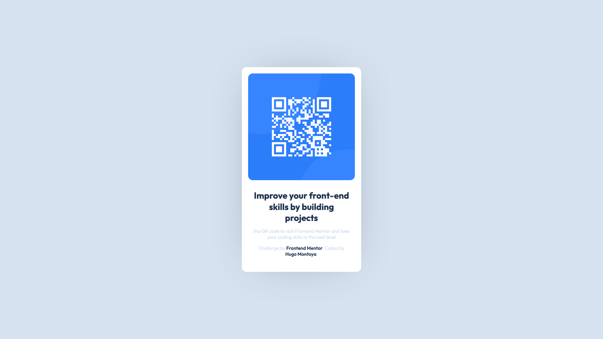

 ## Table of contents

- [Overview](#overview)
  - [Screenshot](#screenshot)
  - [Links](#links)
- [My process](#my-process)
  - [Built with](#built-with)
- [Author](#author)
- [Acknowledgments](#acknowledgments)
## Overview

### Screenshot





### Links

- Solution URL: [QR Card](https://gugor.github.io/qr-code-component-main/)


## My process

### Built with

- Semantic HTML5 markup
- CSS custom properties
- Flexbox
- CSS funtions
- Mobile-first workflow
- Fluid 

### What I learned

I've played with the 'clamp()' function to keep the withs of some elements in a ranged size:

```css
.card 
{
    width: clamp(315px,80vw,380px);
}
```

I've recently learned that this is also a very usefull solution to create responsive sizes for your texts. 

```css
body 
{
    font-size: min(15px,5vw);
}
.qr-heading 
{
    font-size: clamp(1.8em,5vw,2.3em);
}
```
## Author

- Frontend Mentor - [@Gugor](https://www.frontendmentor.io/profile/yourusername)


## Acknowledgments

Thanks to [Frontend Mentor](https://www.frontendmentor.io) for this Newie challenge. 
